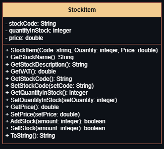

# Testing

## Test Strategy

Make a basic UI which has some buttons to show the user some of the listed stock items in part 1.2. On click of each button,
the user will be shown the item, layed out with the StockType, Description, Price with and without VAT, Stock Code and lastly
how many units are in stock and available to buy. I'll then add an "Add to basket" button, which then reduces the stock
quantity of the selected Stock Item by how much the user requests.      (potentially remove and reword)

Make a basic UI which has some fields for me to input and create the test stock item in part 1.2. I won't hard code it, the
item will be added only while the program is running I'll add buttons to reduce and increase stock by a set amount, and for
the price change. The menu will refresh on each change of state for the stock item, displaying the current correct information
to me.

### Test Case Table

| Test Case | Purpose | Expected Result |
| --------- | ------- | --------------- |
| GUI test |  |  |
| Class test |  |  |

### UML Diagram for the StockItem.java class

.png)

*testing with a dark version of the diagrams
