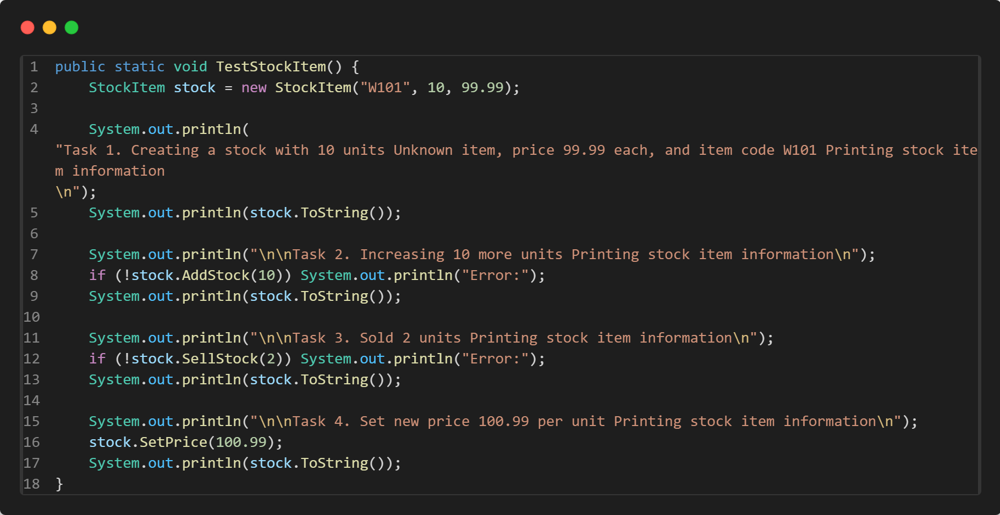
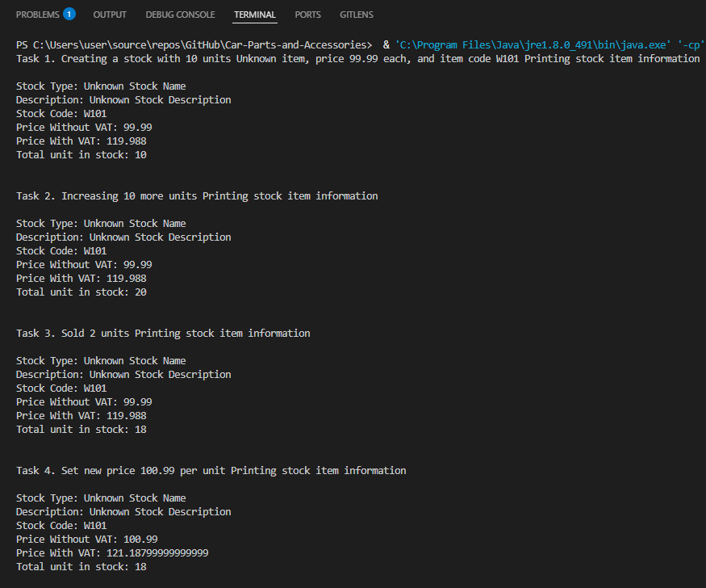
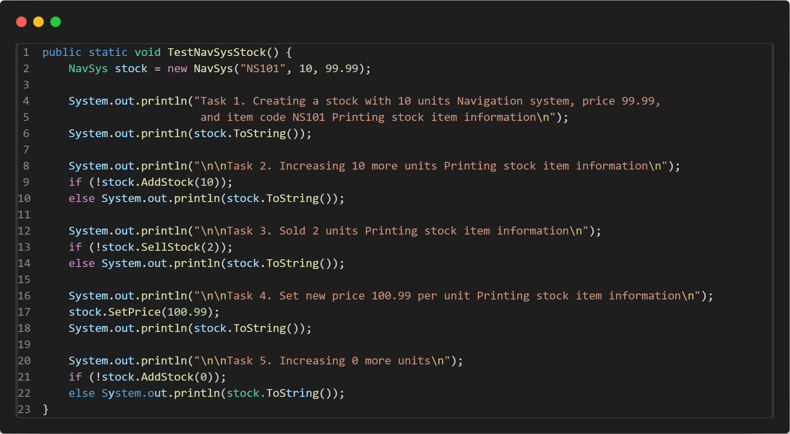
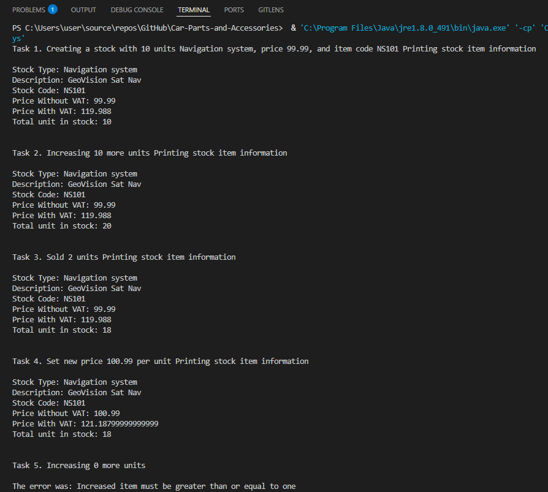

# Testing

## Test Strategy

In the testing document, I’ll show each test in the Test Case table, and each test 
will be headed with the corresponding Test Case number. Under the heading I’ll list the 
relevant information about the test which wasn’t already mentioned in the Test Case table.


Class tests like TestingSysNav (TC2, the testing for StockItem.java (TC1), TestPolymorphism (TC3)
will be outputted to the System terminal in java, all with the code snippet if required and 
the output log from the System terminal. All GUI tests will be carried out in the 
application, with all appropriate code snippets and screenshots


### Test Case Table

| Test Case   | Test Type  | Purpose                                                                                | Expected Result                                                                             | Results Reach Expections? |
|-------------|------------|----------------------------------------------------------------------------------------|---------------------------------------------------------------------------------------------|----------------|
| [TC1](#TC1) | Class Test | To check all the methods and attributes for the class work as expected                 | Shows each iteration of the changing class, and displays exactly what was changed correctly | Yes |
| [TC2](#TC2) | Class Test | To check the NavSys class inheritence works, and that the overrides also work properly | Shows each iteration of the changing class, and displays exactly what was changed correctly | Yes |
| [TC3](#TC3) | Class Test | To check the polymorphism between all classes extending StockItem.java works           | Shows all the different instances of the classes extending StockItem.java                   | Yes |
| [TC4](#TC4) |            |                                                                                        |                                                                                             |     |
| [TC5](#TC5) |            |                                                                                        |                                                                                             |     |
| [TC6](#TC6) |            |                                                                                        |                                                                                             |     |
| [TC7](#TC7) |            |                                                                                        |                                                                                             |     |
| [TC8](#TC8) |            |                                                                                        |                                                                                             |     |
| [TC9](#TC9) |            |                                                                                        |                                                                                             |     |
| [TC10](#TC10)|            |                                                                                        |                                                                                             |     |


## TC1 - Test Case 1 <a name="TC1"></a>

Testing for the StockItem.java class

Code used for the test:



Outputted result to terminal:



StockItem.java UML:


## TC2 - Test Case 2 <a name="TC2"></a>

Testing for the TestingNavSys.java class

Code used for the test:



Outputted result to terminal:




## TC3 - Test Case 3 <a name="TC3"></a>

Testing for the TestPolymorphism.java class

Code for the test is in the [TestPolymorphism.java](https://github.com/WillTuffrey/OOSD1-Assignment/blob/main/CarStockSystem/TestPolymorphism.java) file.

The output from the terminal is way too long to put in an image, so I'll insert it into this box.

````
Current stock information:
Stock Type: Michelin Pilot Sport Cup 2 tyre
Description: 20" Pilot Sport Cup 2 tyre by Michelin
Stock Code: MPSC2
Price Without VAT: 399.0
Price With VAT: 478.8
Total unit in stock: 12

How many units do you want to sell?
5

Units updated.

Stock Type: Michelin Pilot Sport Cup 2 tyre
Description: 20" Pilot Sport Cup 2 tyre by Michelin
Stock Code: MPSC2
Price Without VAT: 399.0
Price With VAT: 478.8
Total unit in stock: 7

How many units do you want to add?
10

Units updated.

Stock Type: Michelin Pilot Sport Cup 2 tyre
Description: 20" Pilot Sport Cup 2 tyre by Michelin
Stock Code: MPSC2
Price Without VAT: 399.0
Price With VAT: 478.8
Total unit in stock: 17

What price would you like to set for this product?
419.50
Price Updated.

Stock Type: Michelin Pilot Sport Cup 2 tyre
Description: 20" Pilot Sport Cup 2 tyre by Michelin
Stock Code: MPSC2
Price Without VAT: 419.5
Price With VAT: 503.4
Total unit in stock: 17

NEXT ITEM

Current stock information:
Stock Type: PILKINGTON 2.07Kg Windscreen
Description: Framed PILKINGTON Windscreen (2.07Kg)
Stock Code: PWS134
Price Without VAT: 236.0
Price With VAT: 283.2
Total unit in stock: 4

How many units do you want to sell?
4

Units updated.

Stock Type: PILKINGTON 2.07Kg Windscreen
Description: Framed PILKINGTON Windscreen (2.07Kg)
Stock Code: PWS134
Price Without VAT: 236.0
Price With VAT: 283.2
Total unit in stock: 0

How many units do you want to add?
100

Units updated.

Stock Type: PILKINGTON 2.07Kg Windscreen
Description: Framed PILKINGTON Windscreen (2.07Kg)
Stock Code: PWS134
Price Without VAT: 236.0
Price With VAT: 283.2
Total unit in stock: 100

What price would you like to set for this product?
236
Price Updated.

Stock Type: PILKINGTON 2.07Kg Windscreen
Description: Framed PILKINGTON Windscreen (2.07Kg)
Stock Code: PWS134
Price Without VAT: 236.0
Price With VAT: 283.2
Total unit in stock: 100

NEXT ITEM

Current stock information:
Stock Type: DRIVETEC Rear Brake Disc
Description: 265mm Brake Disc by DRIVETEC (Rear)
Stock Code: DBR12
Price Without VAT: 106.99
Price With VAT: 128.388
Total unit in stock: 37

How many units do you want to sell?
38
There are not enough items in stock.

Units updated.

Stock Type: DRIVETEC Rear Brake Disc
Description: 265mm Brake Disc by DRIVETEC (Rear)
Stock Code: DBR12
Price Without VAT: 106.99
Price With VAT: 128.388
Total unit in stock: 37

How many units do you want to add?
3

Units updated.

Stock Type: DRIVETEC Rear Brake Disc
Description: 265mm Brake Disc by DRIVETEC (Rear)
Stock Code: DBR12
Price Without VAT: 106.99
Price With VAT: 128.388
Total unit in stock: 40

What price would you like to set for this product?
104
Price Updated.

Stock Type: DRIVETEC Rear Brake Disc
Description: 265mm Brake Disc by DRIVETEC (Rear)
Stock Code: DBR12
Price Without VAT: 104.0
Price With VAT: 124.8
Total unit in stock: 40

NEXT ITEM

Current stock information:
Stock Type: Navigation system
Description: GeoVision Sat Nav
Stock Code: NS101
Price Without VAT: 99.99
Price With VAT: 119.988
Total unit in stock: 10

How many units do you want to sell?
1

Units updated.

Stock Type: Navigation system
Description: GeoVision Sat Nav
Stock Code: NS101
Price Without VAT: 99.99
Price With VAT: 119.988
Total unit in stock: 9

How many units do you want to add?
1

Units updated.

Stock Type: Navigation system
Description: GeoVision Sat Nav
Stock Code: NS101
Price Without VAT: 99.99
Price With VAT: 119.988
Total unit in stock: 10

What price would you like to set for this product?
50
Price Updated.

Stock Type: Navigation system
Description: GeoVision Sat Nav
Stock Code: NS101
Price Without VAT: 50.0
Price With VAT: 60.0
Total unit in stock: 10
````


## TC4 - Test Case 4 <a name="TC4"></a>

