# Testing

## Test Strategy

In the testing document, I’ll show each test in the Test Case table, and each test 
will be headed with the corresponding Test Case number. Under the heading I’ll list the 
relevant information about the test which wasn’t already mentioned in the Test Case table.


Class tests like TestingSysNav (TC2, the testing for StockItem.java (TC1), TestPolymorphism (TC3)
will be outputted to the System terminal in java, all with the code snippet if required and 
the output log from the System terminal. All GUI tests will be carried out in the 
application, with all appropriate code snippets and screenshots


### Test Case Table

| Test Case     | Test Type  | Purpose                                                                               | Expected Result                                                                             | Results Reach Expections? |
|---------------|------------|---------------------------------------------------------------------------------------|---------------------------------------------------------------------------------------------|---------------------------|
| [TC1](#TC1)   | Class Test | To test all the methods and attributes for the class work as expected                 | Shows each iteration of the changing class, and displays exactly what was changed correctly | Yes                       |
| [TC2](#TC2)   | Class Test | To test the NavSys class inheritence works, and that the overrides also work properly | Shows each iteration of the changing class, and displays exactly what was changed correctly | Yes                       |
| [TC3](#TC3)   | Class Test | To test the polymorphism between all classes extending StockItem.java works           | Shows all the different instances of the classes extending StockItem.java                   | Yes                       |
| [TC4](#TC4)   | GUI Test   | To test the functionality of the button                                               | Takes the user to the Stock Overview page                                                   | Yes                       |
| [TC5](#TC5)   | GUI Test   | To test the functionality of the button                                               | Takes the user back to the Main Menu                                                        | Yes                       |
| [TC6](#TC6)   | GUI Test   | To test the functionality of the button                                               | Displays the correct stock information when the button is pressed                           | Yes                       |
| [TC7](#TC7)   | GUI Test   | To test the functionality of the button                                               | Displays the correct stock information when the button is pressed                           | Yes                       |
| [TC8](#TC8)   | GUI Test   | To test the functionality of the button                                               | Displays the correct stock information when the button is pressed                           | Yes                       |
| [TC9](#TC9)   | GUI Test   | To test the functionality of the button                                               | Displays the correct stock information when the button is pressed                           | Yes                       |
| [TC10](#TC10) | GUI Test   | To test the error handling and formatting of the center content panel                 | Displays correct error message without breaking the format of the other items               | Yes                       |
| [TC11](#TC11) | GUI Test   | To test the error handling and formatting of the center content panel                 | Displays correct error message without breaking the format of the other items               | No                        |
| [TC12](#TC12) | GUI Test   | To test the error handling and formatting of the center content panel                 | Displays correct error message without breaking the format of the other items               | Yes                       |
| [TC13](#TC13) | GUI Test   | To test the functionality of the button and the updating content                      | Subtracks the correct amount from the total stock and updates the display                   | Yes                       |
| [TC14](#TC14) | GUI Test   | To test the functionality of the button and the updating content                      | Adds the correct amount to the total stock and updates the display                          | Yes                       |
| [TC15](#TC15) | End Test   | To test the functionality of the button                                               | Closes the application with "exit code 0"                                                   | Yes                       |


## TC1 - Test Case 1 <a name="TC1"></a>

### Testing for the StockItem.java class

Code used for the test:


Outputted result to terminal:


StockItem.java UML:


## TC2 - Test Case 2 <a name="TC2"></a>

### Testing for the TestingNavSys.java class

Code used for the test:


Outputted result to terminal:


## TC3 - Test Case 3 <a name="TC3"></a>

### Testing for the TestPolymorphism.java class

Code for the test is in the [TestPolymorphism.java](https://github.com/WillTuffrey/OOSD1/blob/main/Assignment/TestPolymorphism.java) file.

The output from the terminal is way too long to put in an image, so I'll insert it into this box.

````
Current stock information:
Stock Type: Michelin Pilot Sport Cup 2 tyre
Description: 20" Pilot Sport Cup 2 tyre by Michelin
Stock Code: MPSC2
Price Without VAT: 399.0
Price With VAT: 478.8
Total unit in stock: 12

How many units do you want to sell?
5

Units updated.

Stock Type: Michelin Pilot Sport Cup 2 tyre
Description: 20" Pilot Sport Cup 2 tyre by Michelin
Stock Code: MPSC2
Price Without VAT: 399.0
Price With VAT: 478.8
Total unit in stock: 7

How many units do you want to add?
10

Units updated.

Stock Type: Michelin Pilot Sport Cup 2 tyre
Description: 20" Pilot Sport Cup 2 tyre by Michelin
Stock Code: MPSC2
Price Without VAT: 399.0
Price With VAT: 478.8
Total unit in stock: 17

What price would you like to set for this product?
419.50
Price Updated.

Stock Type: Michelin Pilot Sport Cup 2 tyre
Description: 20" Pilot Sport Cup 2 tyre by Michelin
Stock Code: MPSC2
Price Without VAT: 419.5
Price With VAT: 503.4
Total unit in stock: 17

NEXT ITEM

Current stock information:
Stock Type: PILKINGTON 2.07Kg Windscreen
Description: Framed PILKINGTON Windscreen (2.07Kg)
Stock Code: PWS134
Price Without VAT: 236.0
Price With VAT: 283.2
Total unit in stock: 4

How many units do you want to sell?
4

Units updated.

Stock Type: PILKINGTON 2.07Kg Windscreen
Description: Framed PILKINGTON Windscreen (2.07Kg)
Stock Code: PWS134
Price Without VAT: 236.0
Price With VAT: 283.2
Total unit in stock: 0

How many units do you want to add?
100

Units updated.

Stock Type: PILKINGTON 2.07Kg Windscreen
Description: Framed PILKINGTON Windscreen (2.07Kg)
Stock Code: PWS134
Price Without VAT: 236.0
Price With VAT: 283.2
Total unit in stock: 100

What price would you like to set for this product?
236
Price Updated.

Stock Type: PILKINGTON 2.07Kg Windscreen
Description: Framed PILKINGTON Windscreen (2.07Kg)
Stock Code: PWS134
Price Without VAT: 236.0
Price With VAT: 283.2
Total unit in stock: 100

NEXT ITEM

Current stock information:
Stock Type: DRIVETEC Rear Brake Disc
Description: 265mm Brake Disc by DRIVETEC (Rear)
Stock Code: DBR12
Price Without VAT: 106.99
Price With VAT: 128.388
Total unit in stock: 37

How many units do you want to sell?
38
There are not enough items in stock.

Units updated.

Stock Type: DRIVETEC Rear Brake Disc
Description: 265mm Brake Disc by DRIVETEC (Rear)
Stock Code: DBR12
Price Without VAT: 106.99
Price With VAT: 128.388
Total unit in stock: 37

How many units do you want to add?
3

Units updated.

Stock Type: DRIVETEC Rear Brake Disc
Description: 265mm Brake Disc by DRIVETEC (Rear)
Stock Code: DBR12
Price Without VAT: 106.99
Price With VAT: 128.388
Total unit in stock: 40

What price would you like to set for this product?
104
Price Updated.

Stock Type: DRIVETEC Rear Brake Disc
Description: 265mm Brake Disc by DRIVETEC (Rear)
Stock Code: DBR12
Price Without VAT: 104.0
Price With VAT: 124.8
Total unit in stock: 40

NEXT ITEM

Current stock information:
Stock Type: Navigation system
Description: GeoVision Sat Nav
Stock Code: NS101
Price Without VAT: 99.99
Price With VAT: 119.988
Total unit in stock: 10

How many units do you want to sell?
1

Units updated.

Stock Type: Navigation system
Description: GeoVision Sat Nav
Stock Code: NS101
Price Without VAT: 99.99
Price With VAT: 119.988
Total unit in stock: 9

How many units do you want to add?
1

Units updated.

Stock Type: Navigation system
Description: GeoVision Sat Nav
Stock Code: NS101
Price Without VAT: 99.99
Price With VAT: 119.988
Total unit in stock: 10

What price would you like to set for this product?
50
Price Updated.

Stock Type: Navigation system
Description: GeoVision Sat Nav
Stock Code: NS101
Price Without VAT: 50.0
Price With VAT: 60.0
Total unit in stock: 10
````


## TC4 - Test Case 4 <a name="TC4"></a>

### Testing for the "View Stock" button

When pressed, the button should take the user to the "Stock Overview" page.

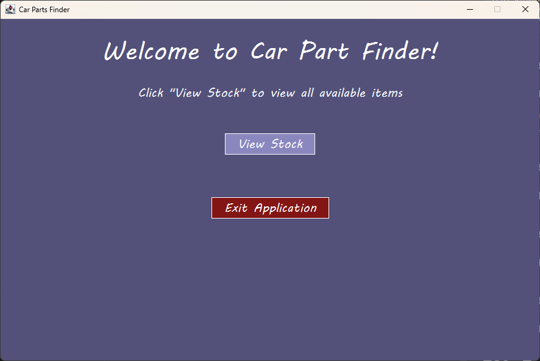

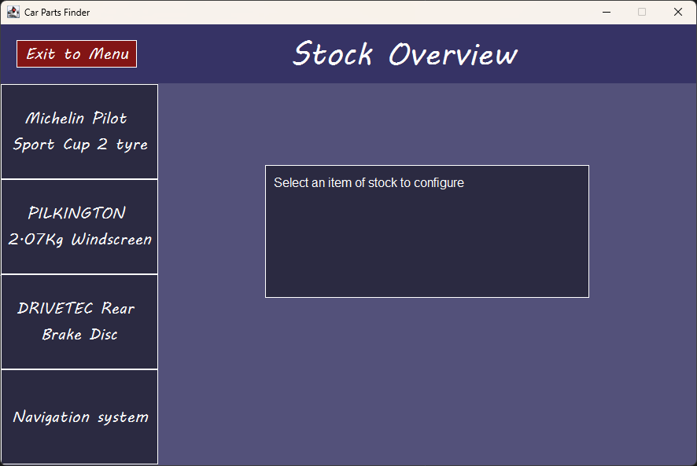

Button takes the user to the "Stock Overview" page, test successful.


## TC5 - Test Case 5 <a name="TC5"></a>

### Testing for the "Exit to Menu" Button

When pressed, the button should take the user back to the Main Menu.

Mouse is hovered over "Exit Application" button - colour changes to bright red.

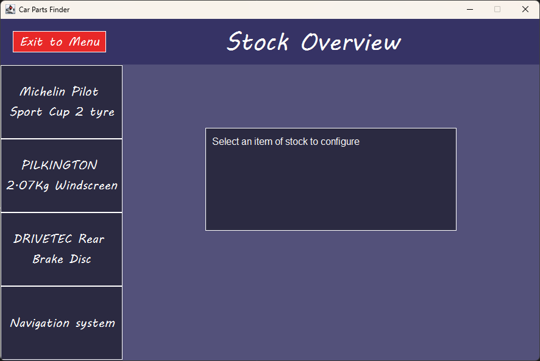

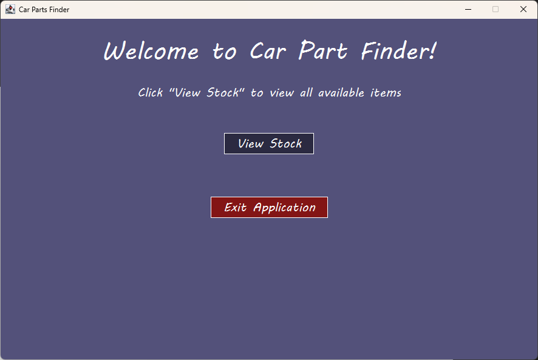

Button takes the user back to the Main Menu, test successful.


## TC6 - Test Case 6 <a name="TC6"></a>

### Testing for the first stock item configure button

Button should display the correct information for the stock item in the text area, display the Sell and Add Stock buttons, and display the textbox for inputting the quantity for selling/adding.

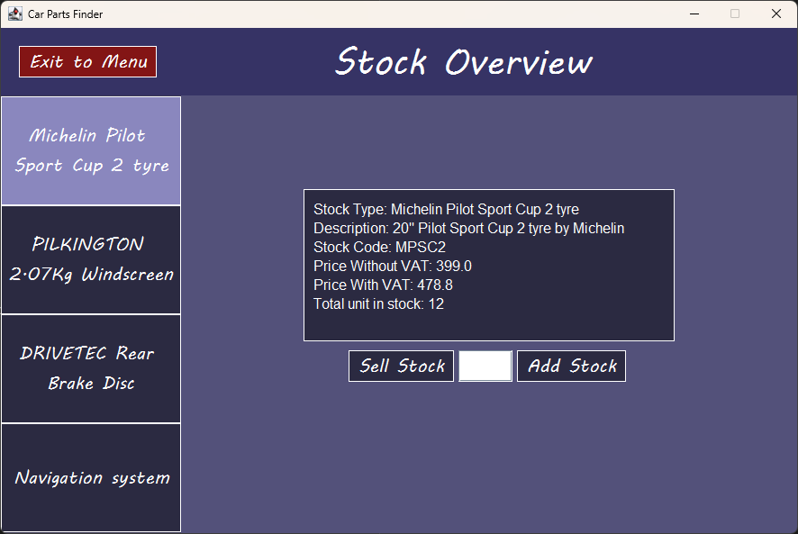

Button does exactly that, test successful.


## TC7 - Test Case 7 <a name="TC7"></a>

### Testing for the second stock item configure button

Button should display the correct information for the stock item in the text area, display the Sell and Add Stock buttons, and display the textbox for inputting the quantity for selling/adding.

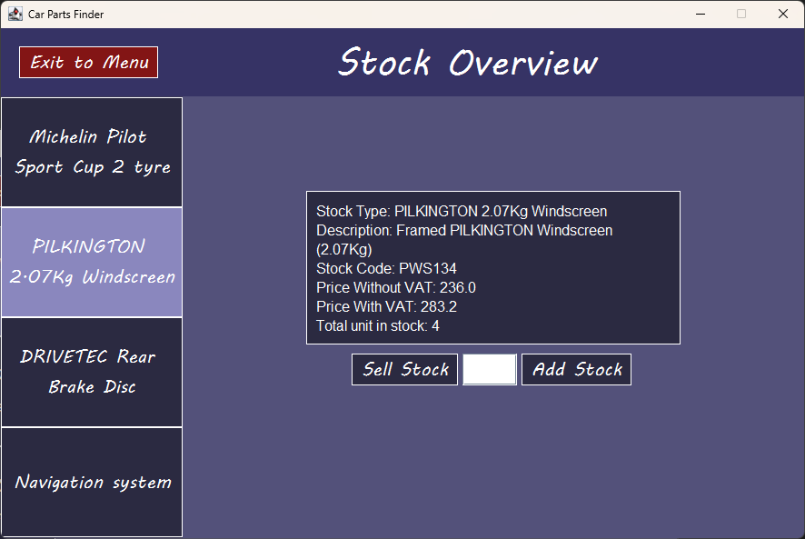

Button does exactly that, test successful.


## TC8 - Test Case 8 <a name="TC8"></a>

### Testing for the third stock item configure button

Button should display the correct information for the stock item in the text area, display the Sell and Add Stock buttons, and display the textbox for inputting the quantity for selling/adding.

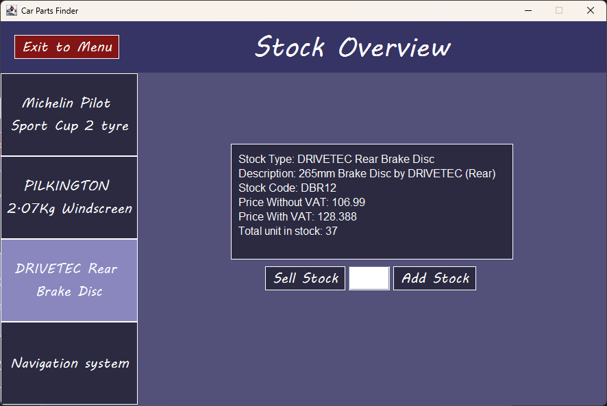

Button does exactly that, test successful.


## TC9 - Test Case 9 <a name="TC9"></a>

### Testing for the fourth stock item configure button

Button should display the correct information for the stock item in the text area, display the Sell and Add Stock buttons, and display the textbox for inputting the quantity for selling/adding.

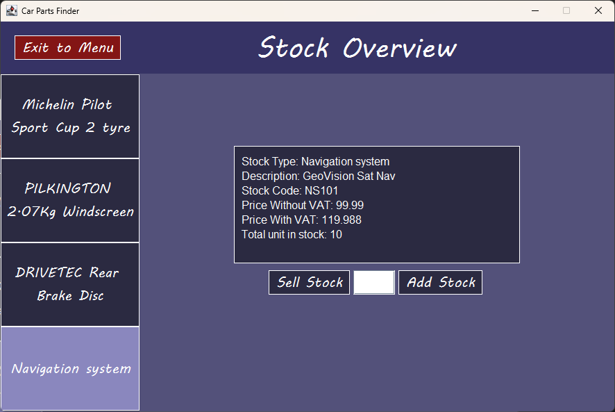

Button does exactly that, test successful.


## TC10 - Test Case 10 <a name="TC10"></a>

### Testing for the "Quantity must be greater than 0" error message

When a number < 0 is entered into the text field, and the option to either Sell or Add to the stock quantity of that negative number is selected, the error message should be shown.

User tries to enter -234 < 0


Error message is shown in yellow. The appearance of the error message doesn't affect the formatting of the other items in the GridBagLayout - TextArea, Sell/Add buttons, TextField

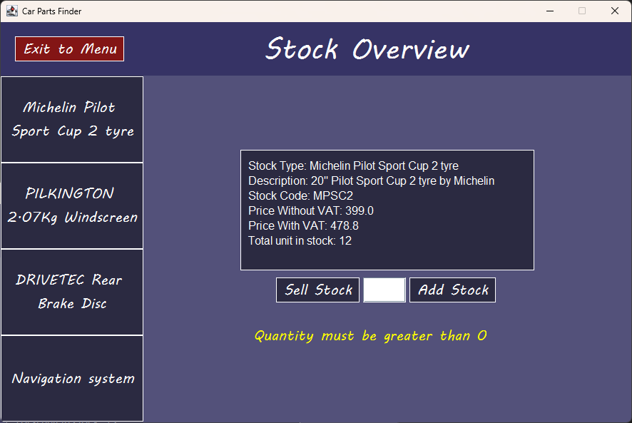

Correct error message is shown for the error, test successful.


## TC11 - Test Case 11 <a name="TC11"></a>

### Testing for the "Stock will exceed the maximum limit of 100 units" error message

When the stock will exceed 100 units when an amount is entered into the text field, the error message should be shown.

User tries to enter 100 - 12 + 100 > 100 units


Error message is shown in yellow. The appearance of the error message DOSE affect the formatting of the other items in the GridBagLayout - TextArea, Sell/Add buttons, TextField

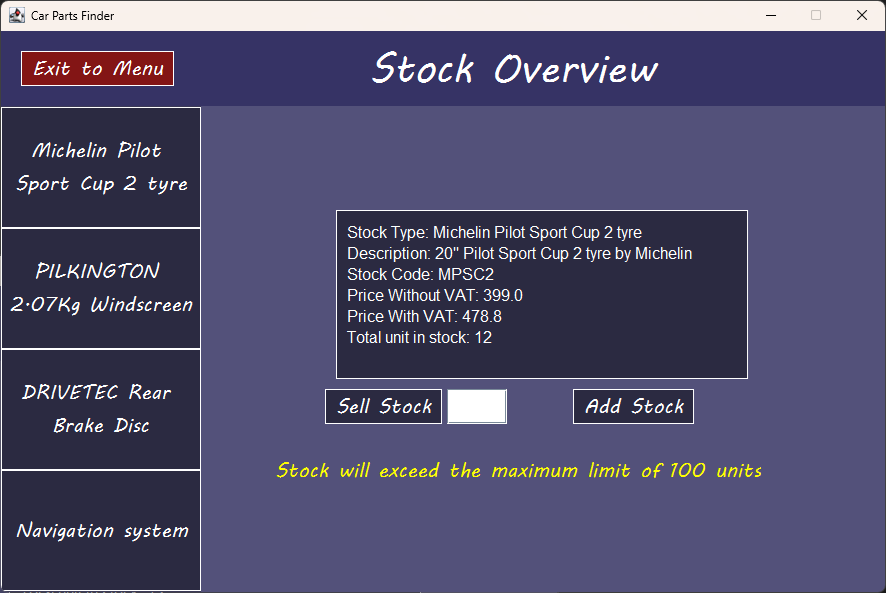

The formatting of the items in the GridBagLayout is affected by the error message, test failed.


## TC12 - Test Case 12 <a name="TC12"></a>

### Testing for the "There are not enough items in stock" error message

If the user tries to sell more stock than they have available, the error message should be shown.

The user tries to sell 13 units - there are only 12 units in stock

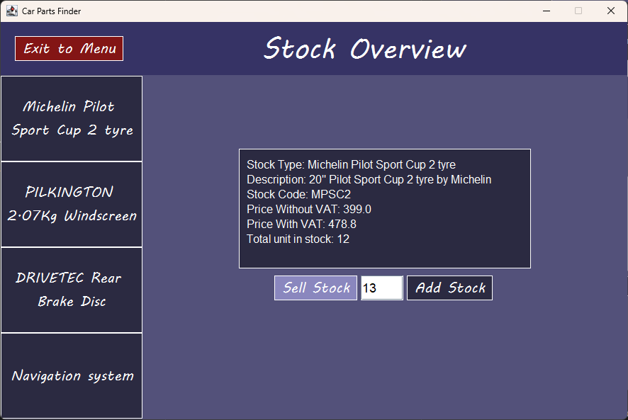

Error message is shown in yellow. The appearance of the error message doesn't affect the formatting of the other items in the GridBagLayout - TextArea, Sell/Add buttons, TextField

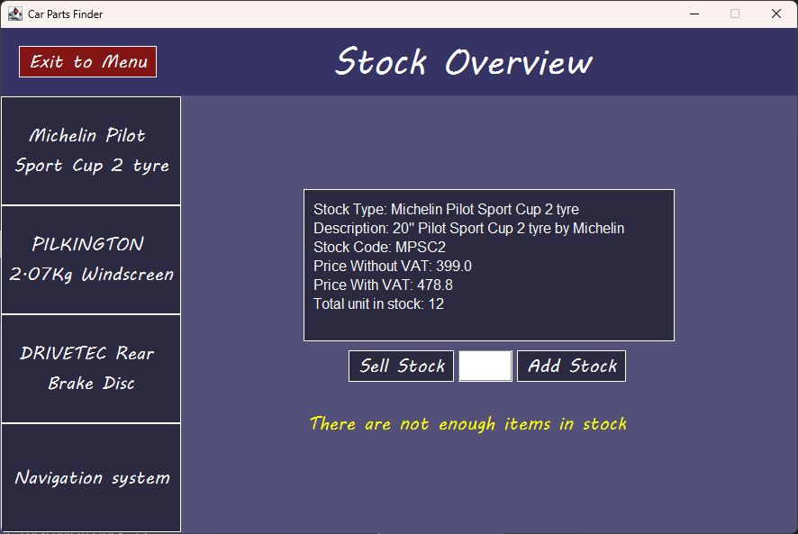

Correct error message is shown for the error, test successful.


## TC13 - Test Case 13 <a name="TC13"></a>

### Testing for the "Sell Stock" button

When the user enters a number of stock to sell within range, the number gets subtracted from the total stock and updated.

The user sells 5 units of stock,


12 - 5 = 7, which is displayed in the TextArea.


The stock is subtracted from the total by the correct amount and updated, test successful.


## TC14 - Test Case 14 <a name="TC14"></a>

### Testing for the "Add Stock" button

When the user enters a number of stock to add within range, the number gets added to the total stock and updated.

The user adds 45 units of stock,

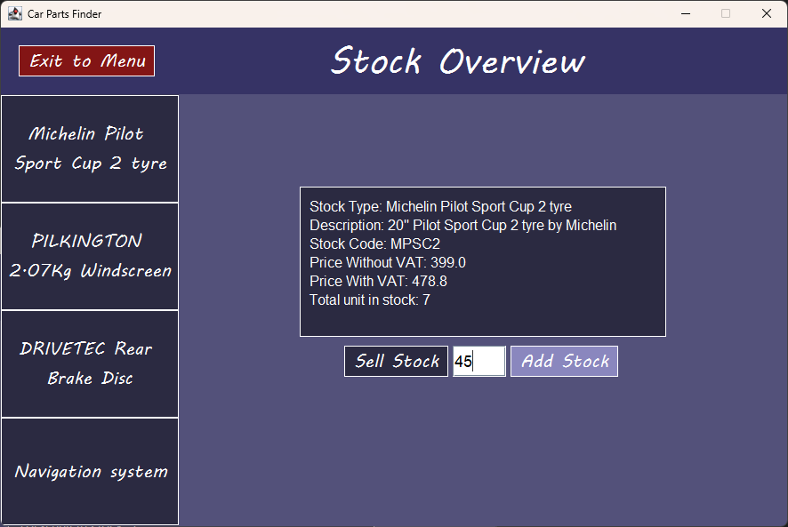

45 + 7 = 52, which is displayed in the TextArea.

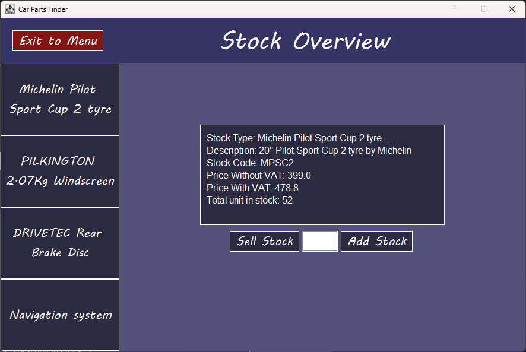

The stock is added to the total by the correct amount and updated, test successful.


## TC15 - Test Case 15 <a name="TC15"></a>

### Testing for the "Exit Application" button

On press, the button should exit the application with an exit code "0"

Mouse is hovered over "Exit Application" button - colour changes to bright red.


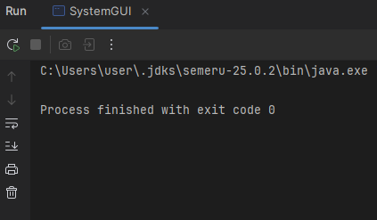

The process finishes with "exit code 0", test successful.

### END OF TESTING